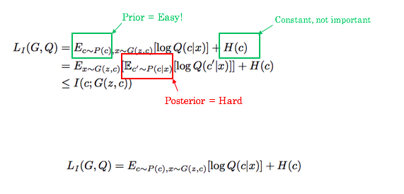
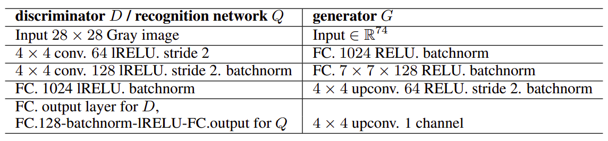

# PyTorch implementation of InfoGAN [*Paper*](https://arxiv.org/pdf/1606.03657.pdf)

## Usage 

## Factual Details
- **Title** : Interpretable Representation Learning by Information Maximizing Generative Adversarial Nets 
- **Dated** : 12.06.2016
- **Authors** : Xi Chen, Yan Duan, Rein Houthooft, John Schulman, Ilya Sutskever, Pieter Abbeel
- **University** : UC Berkley
- **Field** : Deep Learning, Generative Adversarial Networks 

## Contributed by
- [*Gurbaaz Singh Nandra*](https://github.com/gurbaaz27)

# Summary

## A Gentle Intoduction : Why ? 
Since the inception of generative adversarial networks, popularly called GANs, they revolutionised the genrative models understanding, as well as the whole Deep Learning in general. GAN is basically a police-forgerer fight between discriminator and generator, where discriminator tries to classify between real and fake, which serves as a constant purpose for generator to come back hard for discriminator the next time. Over course of time, discriminator has a hard time in telling fake ones from real, as the data has been imitated so well, all unsupervisedly. DCGAN used deep convolution layers and a certain architecture to improve this. 

But still, it seemed that all learning was kinda like black box, and model didnt really get know various features of image, for example, sunglasses, curves, angle. The learning seemed, and was indeed, entangled. InfoGAN proposed disentagled representation of data to acquire these features with the help of latent codes and information maximisation. 

> ***Latent :** something existing but hidden, not manifested, concealed .eg. latent heat of fusion*

## Understanding the Theory : What ? 
The main difference is the addition of latent code 'c' to the tranditional noise vector 'z' fed into the Generator. So now G(z) looks like G(z,c). To hope that the network understands these latent codes in an unsupervised manner, an information-theoretic regularisation is proposed: there should be high mutual information between latent codes c and generator distribution G(z,c). Formally, I(c; G(z, c)) should be high. So basically, an additional regularisation term is added to original GAN objective.

  

Now, as the fairyland it seems, practically maximizing this I(c; G(z,c)) is hard as it requires knowledge of the posterior P(c|x), but we can still find a lower bound solution. This consists of introducing an “auxiliary” distribution Q(c|x), which is modeled by a parameterized neural network, and is meant to approximate the real P(c|x). They then use a re-parameterization trick to make it such that you can merely sample from a user-specified prior (i.e. uniform distribution) instead of the unknown posterior.

  

## Implementing the Architecture : How ?
Auxiliary network Q is modelled as a neural network, and shares most of the structure with that of Discriminator except the last layer, since their purpose are different. For MNIST, linear input of 74 variables is fed, consisting of 62 random noise variables, 10 for the categories we hope would match to each of the digit, and 2 latent codes, 1 for width and other for the rotation of digits, random values between -1 and +1. Even though InfoGAN introduces an extra hyperparameter λ, it’s easy to tune and simply setting to 1 is sufficient for discrete latent codes. Knowing the difficult training of GAN, the paper copies the layers from an existing architecture, [DCGAN](https://arxiv.org/abs/1511.06434). So, to ease things out, InfoGAN basically adds a few components to the DCGAN, latent code 'c', an auxiliary network Q and all the training to estimate c unsupervisedly.

  

## Results : Woah !

## Acknowledgement
- [Toward Data Science: InfoGAN : GANs Part III](https://towardsdatascience.com/infogan-generative-adversarial-networks-part-iii-380c0c6712cd)
- [DCGAN Paper](https://arxiv.org/abs/1511.06434)
- [Google](https://www.google.com) :wink:
