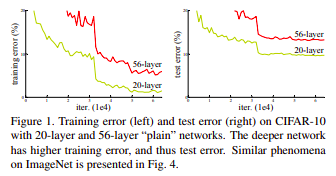
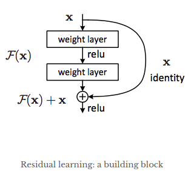
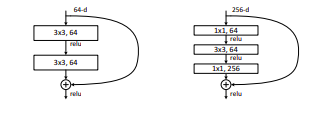

# SUMMARY
## ResNet : Deep Residual Learning for Image Recognition (2015)   [*Paper*](https://arxiv.org/abs/1512.03385)

### Introduction: Why need in the first place ?
Though a shallower network is capable of fitting the data, it is prone to large numbers of parameters and computational complexity. Hence, deeper and deeper networks are being used and have been performing good in these aspects. But the paper presents a basic question: “ ***Is learning better networks as easy as stacking more layers?*** ”. Deeper networks after a certain number of layers start degrading in accuracy, which is not due to overfitting, since both testing and training errors start increasing. These suffer from vanishing gradient problem, as the repeated multiplication may make the gradient too small to help convergence. Experiments conducted on CIFAR 10 show degradation with more stacking of layers. But the VG problem has been addressed by some normalization techniques, so it seems that deeper layers are unable to learn anything from previous layers.

### Deep Residual Architecture
A basic argument is that deeper architecture can be constructed as a shallower architecture with identity mapping layers, hence these should produce no higher training error than its shallower counterpart.  So the architecture proposed is based on explicitly providing stacked layers fit a residual mapping **_F(x) = H(x)-x_**, where H(x) is the underlying mapping we hope the layers to fit. 

### How to Implement the Architecture  : Shortcut/Skip Connections
This is realised by shortcut or skip connections in the feedforward neural network . Shortcut connection means skipping one or more layers. In the **proposed solution**, these simply perform identity mapping and this is added to output of stacked layers. The overall process otherwise remains unaffected, backpropagating end-to-end with SGD, without any increment in number of parameters or computational complexity. They created two 18 and 34 layered models: one plain and other with skip connections. The plain 34 layered model performed way worse than 18, whereas in case of the latter, accuracy increased on adding layers. For implementing even deeper models (50,101,152) a **bottleneck architecture** has been proposed, which uses 3 layers instead of 2 in one residual block, with a sequential 1x1, 3x3, 1x1 convolutions. This helps in reducing parameters and ultimately makes training the model efficient considerably than basic residual block.

### Conclusion
Solution proposed in the paper certainly helped in getting record accuracies on Imagenet, CIFAR10 image classification datasets, and only performed better with deeper models without any degradation. But it certainly started degrading at 1202 layers, which the authors believed caused due to **overfitting**, though it is not confirmed. Hence, further scope in improvement is always appreciated and as I read, various new implementations like DenseNet, ResNext have been in light in the future. 
While implementing the model in PyTorch, I found the implementation was an easy modification of the plain model, and thus was overwhelmed by how simple but intriguing the solution was.
